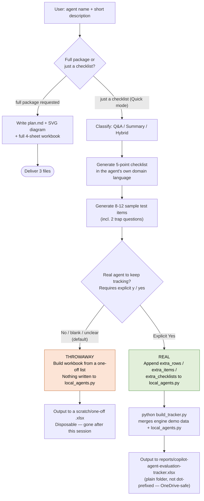
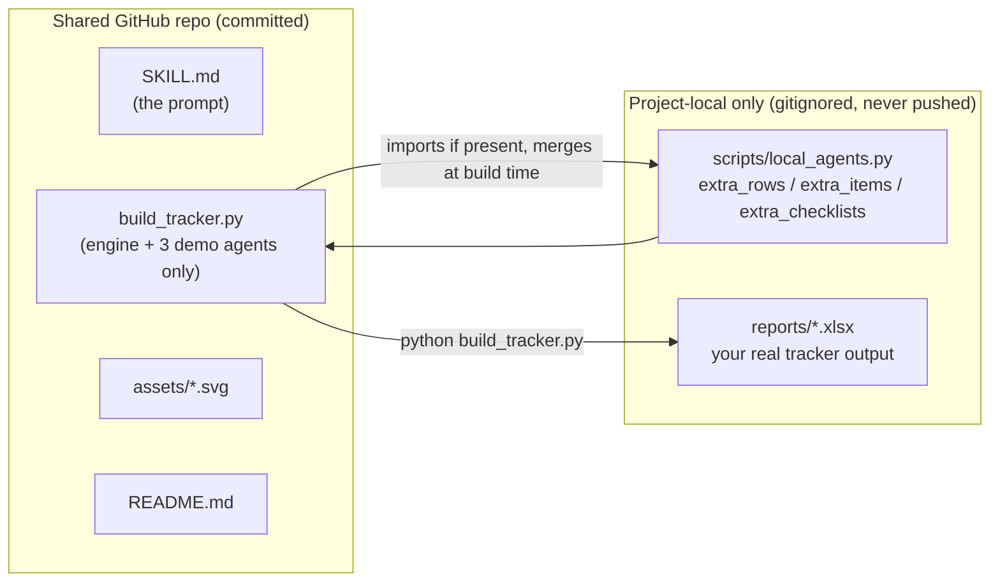

# copilot-agent-eval — Agent Evaluation Skill

A reusable AI skill that helps a development / system-analyst team **evaluate and improve custom Copilot agents** (Q&A bots, technical summarizers, and similar) using a lightweight, human-in-the-loop process. Give it an agent name and a one-line description, and it generates a scoring checklist and sample test items matched to that agent's domain. Ask for the full package and it delivers an evaluation plan, a process diagram, and a fully reconciled Excel tracking workbook.

## What this skill does

| You ask | You get |
|---|---|
| "Create an evaluation checklist for my *Invoice Q&A Bot*" | A 5-point Pass/Partial/Fail scoring checklist rewritten in your agent's domain language, plus 8–12 ready-to-use sample test items (including trap questions) |
| "Create the full evaluation plan / package" | `copilot-agent-evaluation-plan.md` (framework, phased plan, metrics, troubleshooting playbook) |
| "Give me the process diagram" | `copilot-agent-evaluation-flow.svg` — 6-step flow your whole team can read at a glance |
| "Build / update the tracking workbook" | `copilot-agent-evaluation-tracker.xlsx` — 4 sheets (Agent Tracker, Iteration Log, Scoring Checklist, Test Item Log) where all pass rates are formulas fed from item-level scores, so the numbers always reconcile |

## The method in one paragraph

Build a small frozen **golden dataset** (10–20 documents, with trap questions) → run a **baseline** → **score by hand** with a 3-point Pass/Partial/Fail scale → **map failures** to prompt weaknesses and fix only the top 2–3 → change **one thing per round** and re-run until ≥90% pass → **pilot and monitor**, feeding every real failure back into the test set. Q&A agents and summary agents are always scored with different criteria. Automated LLM-as-a-judge scoring comes last, never first.

---

## Program logic flow

Every "test my agent" request goes through the same fork: classify the agent, generate its checklist and test items, then decide — **explicitly, never by inference** — whether this run is disposable or gets remembered.



**The one rule that never bends:** `local_agents.py` is gitignored. Whether an agent is throwaway or real, its actual business data (invoice numbers, room names, salary figures, asset models...) **never reaches the shared GitHub skill repo**. Only genuine engine changes to `build_tracker.py` / `SKILL.md` / docs get committed — never a specific agent's rows.



---

## File structure

```
copilot-agent-eval/
├── SKILL.md                                    # The skill prompt (role, workflow, guardrails) — committed
├── README.md                                   # This file — committed
├── .gitignore                                  # Keeps generated files & real agent data out of git
├── assets/
│   └── copilot-agent-evaluation-flow.svg       # Reference process diagram (browser / draw.io) — committed
└── scripts/
    ├── build_tracker.py                        # Shared ENGINE: builds the 4-sheet Excel tracker — committed
    │                                            #   ships with 3 illustrative demo agents ONLY, never real data
    └── local_agents.py                         # Your REAL agents (gitignored, project-local, never committed)
                                                 #   defines extra_rows / extra_items / extra_checklists,
                                                 #   auto-merged into build_tracker.py's output if present
```

Generated deliverables (`*.xlsx`, throwaway scratch files, `__pycache__/`) are excluded by `.gitignore` and should be written to a plain project folder such as `reports/` at the repo root — never inside `.claude/skills/...` (OneDrive can fail to open files under a dot-prefixed folder) and never committed alongside the engine.

`scripts/build_tracker.py` is self-contained: `pip install openpyxl`, then `python build_tracker.py [output.xlsx]`. It prints a pass-rate self-check after saving so you can confirm the numbers match the story in the data.

---

## Installation

### Claude Code (native support — recommended)

Skills are folders containing a `SKILL.md`. Copy this **whole folder** to either location:

| Scope | Location | Effect |
|---|---|---|
| One project | `<project>/.claude/skills/copilot-agent-eval/` | Everyone who clones the repo gets it |
| All projects on your machine | `~/.claude/skills/copilot-agent-eval/` (Windows: `C:\Users\<you>\.claude\skills\...`) | Personal, machine-wide |

Then in any Claude Code session: type **`/copilot-agent-eval`**, or just ask naturally ("evaluate my new HR bot") — the `description:` frontmatter lets Claude trigger it automatically.

```bash
# quickest install from this repo
git clone <this-repo-url>
cp -r copilot-agent-eval ~/.claude/skills/
```

### Claude.ai / Claude Desktop (Projects)

Create a Project and paste the body of `SKILL.md` (everything below the `---` frontmatter) into **Project instructions**. Upload the SVG and `build_tracker.py` as project files so Claude can reference them.

### OpenAI Codex CLI

Codex reads instructions from `AGENTS.md` files (global and per-repo):

1. **Per-repo:** copy this folder into the repo (e.g. `skills/copilot-agent-eval/`), then add to the repo-root `AGENTS.md`:
   ```markdown
   ## Skill: Copilot agent evaluation
   When asked to evaluate, score, or improve a custom Copilot/AI agent,
   follow the instructions in skills/copilot-agent-eval/SKILL.md exactly.
   Use skills/copilot-agent-eval/scripts/build_tracker.py to generate the
   Excel tracker instead of writing spreadsheet code from scratch.
   ```
2. **Global:** append the same pointer (or the full SKILL.md body) to `~/.codex/AGENTS.md`.

### GitHub Copilot (VS Code / github.com)

Two supported mechanisms — use both for best results:

1. **Repository custom instructions** — create `.github/copilot-instructions.md` in the repo and add a pointer:
   ```markdown
   When the user asks to evaluate, score, or improve a custom Copilot/AI agent,
   follow skills/copilot-agent-eval/SKILL.md in this repository.
   ```
   Copilot Chat automatically includes this file as context for every chat in the repo.
2. **Prompt file (reusable slash command)** — create `.github/prompts/agent-eval.prompt.md` (VS Code: enable prompt files in settings) containing the full body of `SKILL.md`. Team members then run it in Copilot Chat with **`/agent-eval`** plus their agent name:
   ```
   /agent-eval Invoice Q&A Bot — answers supplier invoice questions from the AP knowledge base
   ```

> Note: Copilot Chat cannot execute Python itself. Team members run `scripts/build_tracker.py` in their own terminal after Copilot edits the data blocks.

### Other assistants (Cursor, Windsurf, Gemini CLI, etc.)

Any assistant that supports project rules/instructions files works the same way: keep this folder in the repo and point the assistant's rules file (`.cursor/rules`, `.windsurfrules`, `GEMINI.md`, ...) at `skills/copilot-agent-eval/SKILL.md`. As a last resort, paste the SKILL.md body as the first message of a new conversation.

---

## How to use — step-by-step playbook for new users

This section walks a brand-new user through the two run types the skill supports. **Every run starts identically** (steps 1–3); it only forks at step 4 depending on whether you want the agent kept.

| Step | What happens | Where it lives afterward |
|---|---|---|
| 1. Ask | You give an agent name + one-line description | — |
| 2. Classify | Skill labels it Q&A / Summary / Hybrid | — |
| 3. Generate | Checklist (5 domain-specific checks) + 8–12 test items (incl. 2 traps) | Shown in chat |
| 4. **Fork** | You say throwaway (or nothing) → **disposable**. You say "real agent" → **persisted** | `local_agents.py` (real only) |
| 5. Build | `python build_tracker.py` merges engine + (if real) your local data | `reports/*.xlsx` |

### Worked example 1 — Throwaway test run

Use this when you're experimenting, demoing the skill, or drafting an agent that doesn't exist yet.

1. **You ask:**
   > "Test run eval new agent: Snack Vending Bot — answers questions about what snacks are in the office vending machine and their prices."
2. **Skill classifies it:** Q&A agent.
3. **Skill generates in-chat only:**
   - A 5-point checklist rewritten for vending-machine domain (e.g. "Does it quote the correct price and slot code?" with a FAIL example like "quotes ฿25 for a snack that costs ฿35").
   - 8–12 sample test items, 2 of them traps ("What's in the machine on the 5th floor?" when only the 3rd-floor machine is documented).
4. **Skill asks:** *"Is this a real agent evaluation you want to keep tracking? (y/N)"*
5. **You reply anything other than an unambiguous "y"/"yes"** (nothing, "n", "just testing", or contradictory wording like "dummy real agent") →
   - Nothing is written to `scripts/local_agents.py`.
   - Nothing is written to `scripts/build_tracker.py` either (that file never takes agent data, real or fake).
   - If you ask for a workbook, it's built from a one-off in-memory list to a scratch filename (e.g. `reports/snack-bot-scratch.xlsx`) and treated as disposable.
   - **Nothing here is ever committed to git.**

Result: you got a full checklist + test set to review or demo, and the repo is untouched.

### Worked example 2 — Real agent, kept in the tracker

Use this for an agent your team is actually piloting.

1. **You ask, stating explicitly that it's real:**
   > "Test run eval new agent: IT Asset Request Bot — answers questions about requesting laptops, monitors, and other equipment from the IT asset knowledge base. Real agent."
2. **Skill classifies it:** Q&A agent.
3. **Skill generates:**
   - Checklist: 5 checks in asset-request language (e.g. "Are figures like turnaround days and cost thresholds accurate vs. the KB?" FAIL example: "says 5-day turnaround when the KB says 3 days").
   - 10 test items: `AR-01`…`AR-08` plus 2 traps (`AR-T01` phone reimbursement, `AR-T02` VPN/account access) — topics that sound related but are outside the equipment-request KB.
4. **Because you said "Real agent" explicitly**, the skill:
   - Appends a new row to `extra_rows`, ten items to `extra_items`, and a checklist block to `extra_checklists` inside `scripts/local_agents.py` (gitignored — this is a **local save, not a git commit**).
   - Runs `python build_tracker.py reports/copilot-agent-evaluation-tracker.xlsx`.
5. **You get:** `reports/copilot-agent-evaluation-tracker.xlsx` with a new Sheet 1 row ("IT Asset Request Bot", Phase 0, In Progress), the checklist appended to Sheet 3, and the 10 items appended to Sheet 4 — ready for you to assign an owner, grow the source-doc set to 10–20 documents, and run a baseline.

Result: the agent is now tracked locally and will still be there next session — but its data never touches the shared GitHub repo, only your project folder.

### Quick reference — throwaway vs. real

```
                        THROWAWAY (default)        REAL (explicit "y"/"yes")
                        ──────────────────          ─────────────────────────
local_agents.py          not touched          →     new row/items/checklist appended
build_tracker.py         never touched        →     never touched (engine only)
Output workbook           scratch/one-off       →     reports/*.xlsx (persists)
Survives next session?         No                          Yes (local file)
Ever reaches GitHub?           No                          No — always local-only
```

### Full package instead of Quick mode

If you ask for the **full package** ("build the complete evaluation package for X") instead of just a checklist, the skill also writes `copilot-agent-evaluation-plan.md` (framework + phased plan + troubleshooting playbook) and `copilot-agent-evaluation-flow.svg` (the 6-step diagram) — see the "Program logic flow" diagrams above for how the engine/local-data split still applies underneath.

### Running the phases after setup

Once an agent (throwaway or real) has a workbook, follow the 5-phase loop recorded in Sheet 1:

**Phase 0** Golden Dataset → **Phase 1** Baseline Run → **Phase 2** Score by Hand + Failure Mapping (fix top 2–3 only) → **Phase 3** Fix & Re-run (one change per round) → **Phase 4** Pilot & Monitor.

Score every item in Sheet 4 (Pass/Partial/Fail using Sheet 3's checklist); log every fix round in Sheet 2. Sheets 1 and 2 percentages are formulas fed from Sheet 4, so they update automatically — never type over a green-font cell.

## Quality gates baked into the skill

- Any hallucinated fact = automatic **Fail** (target hallucination rate <2%)
- Trap questions must get an honest "I don't know" (target 100%)
- Numbers/units/codes in summaries: zero-tolerance transcription accuracy
- One change per iteration round, full re-run, keep only non-regressing improvements
- No automated LLM-judge scoring until it agrees with human scoring ≥85% of the time
